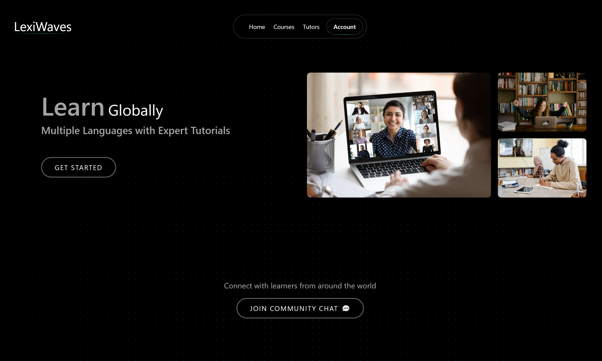

# LexiWaves - Online Language Learning Platform

[](https://sonarcloud.io/summary/new_code?id=shinas07_LexiWaves)
[](https://sonarcloud.io/summary/new_code?id=shinas07_LexiWaves)
[](https://sonarcloud.io/summary/new_code?id=shinas07_LexiWaves)
[](https://sonarcloud.io/summary/new_code?id=shinas07_LexiWaves)
[](https://sonarcloud.io/summary/new_code?id=shinas07_LexiWaves)



## 🌟 Overview

LexiWaves is a comprehensive online language learning platform that connects students with expert tutors. Built with modern technologies, it offers real-time classes, interactive learning experiences, and robust administrative controls.

## ✨ Key Features

### For Students
- **Course Discovery & Enrollment**
  - Browse available courses
  - Filter by language, level, and price
  - Secure payment integration with Stripe

### For Tutors
- **Course Management**
  - Create and manage course content
  - Schedule live classes
  - Track student progress

### Live Learning
- **Real-time Video Classes**
  - Integrated Agora.io video platform
  - Interactive whiteboard
  - Screen sharing capabilities

### Administrative Tools
- **Comprehensive Dashboard**
  - User management
  - Course oversight
  - Revenue tracking
  - Performance analytics

## 🛠 Tech Stack

### Backend
- **Framework**: Django 4.x
- **API**: Django REST Framework
- **Database**: PostgreSQL
- **Cache**: Redis
- **Task Queue**: Celery
- **Storage**: AWS S3

### Frontend
- **Framework**: React 18
- **State Management**: Redux Toolkit
- **Styling**: Tailwind CSS
- **API Client**: Axios

### Infrastructure
- **Containerization**: Docker
- **CI/CD**: GitHub Actions
- **Cloud**: AWS
- **Monitoring**: SonarCloud

## 🚀 Getting Started

### Prerequisites
```bash
# Required installations
- Python 3.10+
- Node.js 16+
- PostgreSQL
- Redis
```

### Backend Setup
```bash
# Clone repository
git clone https://github.com/shinas07/LexiWaves.git
cd LexiWaves/Server

# Create virtual environment
python -m venv env
source env/bin/activate  # Linux/Mac
env\Scripts\activate     # Windows

# Install dependencies
pip install -r requirements.txt

# # Environment setup
# cp .env.example .env    # Configure your environment variables

# Database setup
python manage.py migrate

# Start server
python manage.py runserver
```

### Frontend Setup
```bash
# Navigate to frontend
cd Client/lexiwaves

# Install dependencies
npm install

# Start development server
npm run dev
```

## 🔒 Environment Variables

```env
# Backend (.env)
SECRET_KEY=your_secret_key
DB_NAME=lexiwaves
DB_USER=your_db_user
DB_PASSWORD=your_db_password
STRIPE_SECRET_KEY=your_stripe_key
AWS_ACCESS_KEY_ID=your_aws_key
AWS_SECRET_ACCESS_KEY=your_aws_secret
AGORA_APP_ID=your_agora_id
```

## 📚 API Documentation

API documentation is available at:
- Development: `http://localhost:8000/api/docs/`
- Production: `https://api.lexiwaves.com/docs/`


<!-- ## 🤝 Contributing

1. Fork the repository
2. Create your feature branch (`git checkout -b feature/AmazingFeature`)
3. Commit changes (`git commit -m 'Add: AmazingFeature'`)
4. Push to branch (`git push origin feature/AmazingFeature`)
5. Open a Pull Request
 -->
